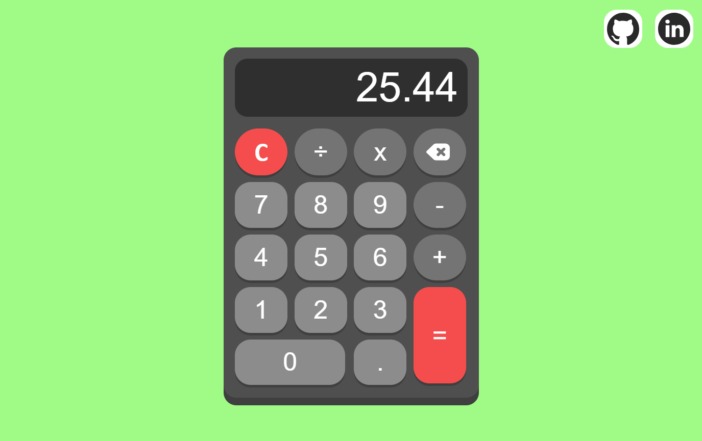

# Calendar Web Application

## Overview
A web-based calendar application designed to provide users with a simple and intuitive way to manage their schedules.

## Features
- User-friendly interface
- Easy event creation and management
- Customizable calendar views
- Real-time updates
- Multiple calendar views (day, week, month)
- Event reminders and notifications
- Integration with Google Calendar and other calendar services
- Mobile optimization for on-the-go access
- Advanced search functionality
- Support for recurring events
- Event invitations and RSVP tracking
- Calendar sharing and collaboration tools
- Customizable event fields and categories
- Support for attachments and files
- Advanced security features to protect user data

## Developed By

Giridharan S

 

## Screenshots

 

## Getting Started
To get started with the application, simply navigate to the index.html file and open it in your preferred web browser.

## Contributing
Contributions are welcome! If you'd like to contribute to the project, please fork the repository and submit a pull request with your changes.

## License
This project is licensed under the MIT License. See LICENSE for details.    